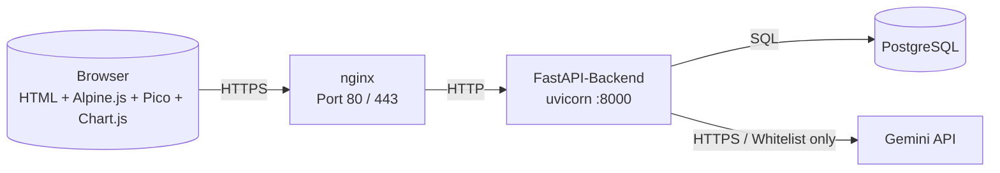

# Architektur

## Überblick

Klassische Drei-Schicht-Anwendung mit strikter Frontend/Backend-Trennung.
Das Frontend läuft als statisches HTML/JS im Browser und spricht
ausschließlich die REST-API des Backends. Das Backend kapselt alle
Geschäftslogik – Preisstrategien, Authentifizierung, Rate Limiting,
LLM-Aufrufe – und hält als einzige Instanz DB- und Gemini-API-Zugänge.
nginx sitzt als Reverse-Proxy davor und terminiert optional TLS
(Let's Encrypt, per UI-Klick aktivierbar).

## Komponentendiagramm

## Komponenten

| Komponente | Verantwortung | Technologie | Datenzugriff |
| --- | --- | --- | --- |
| Browser | UI, Live-Simulation, Formel-Vorschau im JS-Evaluator | HTML + Alpine.js 3 + Pico.css 2 + Chart.js 4, alles via CDN | kein DB-Zugriff, nur REST |
| nginx | Reverse-Proxy, TLS-Terminierung (optional), Cookie-Invalidierung bei 5xx | nginx 1.22 (Debian-Paket) | – |
| FastAPI-Backend | Auth, Produkt-CRUD, Strategie-Evaluator, LLM-Orchestrierung, Rate Limit | Python 3.11 + FastAPI + SQLAlchemy 2 + Alembic | einzige Instanz mit DB- und LLM-Zugriff |
| PostgreSQL | Produkte, Strategien, Preis-Historie, Benutzer, Einstellungen, API-Zähler | PostgreSQL ≥ 15 (Debian-Default) | – |
| Gemini API | Preisvorschläge (Fix oder Formel) + Wettbewerbs-Schätzungen | externer Dienst von Google | erhält ausschließlich die Produkt-Whitelist |

## Datenfluss (Beispiel: KI-Preisvorschlag)

1. Frontend ruft `POST /products/{id}/strategy/prompt-preview` → Backend
   baut den Prompt, zeigt ihn der UI, **ruft aber Gemini noch nicht auf**.
2. User klickt „KI fragen" → `POST /products/{id}/strategy/suggest` →
   Backend schickt denselben Prompt plus Whitelist-Felder an Gemini,
   validiert die Antwort (Regex, AST-Parse für Formeln), liefert
   Vorschlag + Begründung zurück.
3. User speichert → `PUT /products/{id}/strategy`; Backend persistiert
   die Strategie und schreibt einen Snapshot in `price_history`.

## Architekturprinzipien

- **Frontend/Backend-Trennung ist nicht verhandelbar.** Das Frontend
  hält keine DB-Verbindung, keinen LLM-Key, keine Geschäftslogik außer
  der reinen Live-Preisvorschau.
- **LLM ist austauschbar.** Nur `app/llm.py` kennt den konkreten
  Anbieter (aktuell Gemini, siehe
  [ADR 0002](./decisions/0002-llm-provider.md)). Die Router verwenden
  eine abstrakte Schnittstelle `suggest_price` / `suggest_strategy`.
- **Human-in-the-Loop** auf allen KI-Pfaden: kein Auto-Apply, jede
  Übernahme ist eine explizite Admin-Aktion.
- **Zweckbindung gegenüber dem LLM:** nur Produktdaten im Prompt, nie
  Kundendaten. Whitelist zentral in
  `app/strategies/llm.py::_whitelist` und
  `app/routers/products.py::_strategy_whitelist`.
- **Admin-only** für HTTPS-Aktivierung, Rate-Limit-Konfiguration und
  Benutzerverwaltung. Server- und UI-seitige Prüfung.

## Verweise

- Datenmodell + Migrationen: [`data-model.md`](./data-model.md)
- REST-Endpoints: [`api-contract.md`](./api-contract.md)
- Sicherheitsmaßnahmen: [`security.md`](./security.md)
- Deployment-Details: [`decisions/0005-deployment-debian.md`](./decisions/0005-deployment-debian.md)
