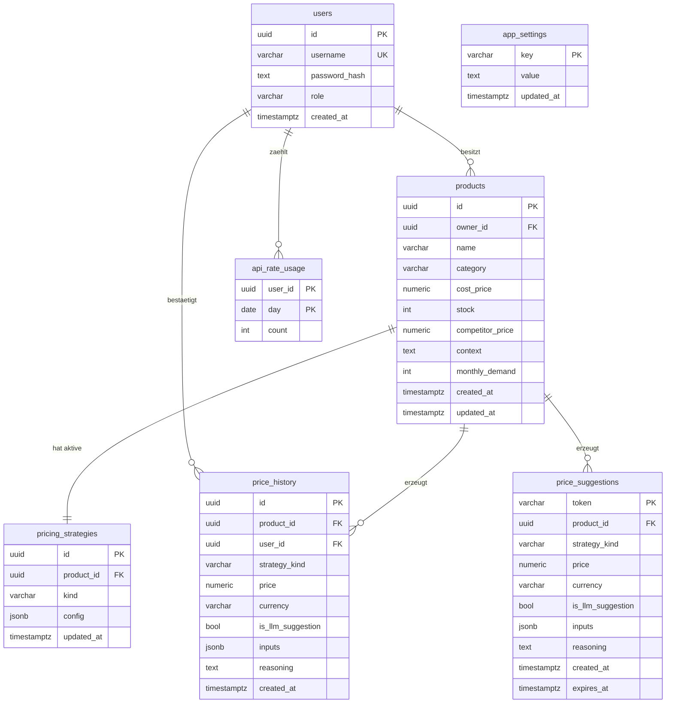

# Datenmodell

Persistiert in PostgreSQL. Migrationen via Alembic. Geldbeträge als
`numeric(12,2)`, Zeitstempel als `timestamptz` in UTC. UUIDs per
`gen_random_uuid()`. Detail-Schema siehe SQLAlchemy-Models unter
[`backend/app/models.py`](../backend/app/models.py).

## Entitäten

| Tabelle | Zweck | Besonderheit |
| --- | --- | --- |
| `users` | Login-Konten (Admin + Team-Accounts) | bootstrap-Admin `admin` ist gegen PUT/DELETE geschützt |
| `products` | Produkt-Stammdaten des Shop-Betreibers | `stock` = Lagergröße (Obergrenze); aktueller Bestand lebt im Frontend |
| `pricing_strategies` | Genau eine aktive Strategie pro Produkt (1:1) | Config als JSONB, strategie-spezifisch validiert |
| `price_history` | Append-only Audit-Trail jeder bestätigten Berechnung | `is_llm_suggestion`-Flag markiert KI-Ursprung |
| `price_suggestions` | Ephemere Vorschläge im Zwei-Schritt-Flow (Price → Confirm) | TTL via `SUGGESTION_TTL_MINUTES` |
| `app_settings` | Key/Value-Store für Laufzeit-Konfiguration | Gemini-Key, HTTPS-Domain, Rate-Limits |
| `api_rate_usage` | Tägliche API-Nutzungszähler pro Benutzer | (user_id, day) als zusammengesetzter PK |

## ERD

## Felddetails (Auszug)

### `products`

| Spalte | Typ | Constraint |
| --- | --- | --- |
| `name` | `varchar(128)` | NOT NULL |
| `category` | `varchar(64)` | NOT NULL |
| `cost_price` | `numeric(12,2)` | NOT NULL, ≥ 0 |
| `stock` | `integer` | NOT NULL, ≥ 0 |
| `competitor_price` | `numeric(12,2)` | NULL erlaubt, sonst ≥ 0 |
| `context` | `text` | Freitext für LLM-Prompt |
| `monthly_demand` | `integer` | NOT NULL, ≥ 0 |

### `pricing_strategies.kind`

`CHECK IN ('fix','formula')` – mehr Varianten gibt es nicht. Migration
0007 hat den Constraint eng gezogen und eventuelle Altlasten entfernt
(siehe [`pricing-strategies.md`](./pricing-strategies.md)).

### `price_history`

Append-only. Kein `UPDATE`/`DELETE` im normalen Flow. `user_id` ist
`ON DELETE SET NULL` – gelöschte Benutzer bleiben im Audit-Trail
anonymisiert sichtbar.

### `app_settings`-Keys

`gemini_api_key`, `https_enabled`, `https_domain`, `rate_limit_default`,
`rate_limit_admin`.

## Migrations-Status

| Revision | Inhalt |
| --- | --- |
| `0001_initial` | Grundtabellen users/products/pricing_strategies/price_history/price_suggestions |
| `0002_product_context_demand` | Produkt-Felder `context`, `monthly_demand`, `daily_usage` |
| `0003_app_settings` | Tabelle `app_settings` |
| `0004_price_history_user` | `price_history.user_id` (nullable FK) |
| `0005_drop_daily_usage` | `daily_usage` entfernt – ersetzt durch Live-Slider `demand` |
| `0006_api_rate_usage` | Tabelle `api_rate_usage` |
| `0007_drop_legacy_strategies` | Check-Constraint auf `('fix','formula')` eingeengt, Alt-Einträge `rule`/`llm` gelöscht |
