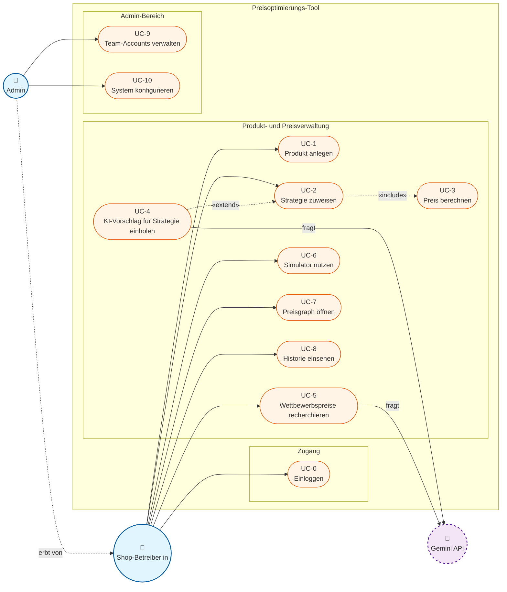

```mermaid
flowchart LR
  %% Akteure
  User(("👤<br/>Shop-Betreiber:in"))
  Admin(("👤<br/>Admin"))
  LLM(("🤖<br/>Gemini API"))

  %% Systemgrenze
  subgraph System["Preisoptimierungs-Tool"]
    direction TB

    subgraph Auth["Zugang"]
      UC0([UC-0<br/>Einloggen])
    end

    subgraph Kern["Produkt- und Preisverwaltung"]
      UC1([UC-1<br/>Produkt anlegen])
      UC2([UC-2<br/>Strategie zuweisen])
      UC3([UC-3<br/>Preis berechnen])
      UC4([UC-4<br/>KI-Vorschlag für Strategie einholen])
      UC5([UC-5<br/>Wettbewerbspreise recherchieren])
      UC6([UC-6<br/>Simulator nutzen])
      UC7([UC-7<br/>Preisgraph öffnen])
      UC8([UC-8<br/>Historie einsehen])
    end

    subgraph AdminArea["Admin-Bereich"]
      UC9([UC-9<br/>Team-Accounts verwalten])
      UC10([UC-10<br/>System konfigurieren])
    end
  end

  %% Shop-Betreiber:in
  User --> UC0
  User --> UC1
  User --> UC2
  User --> UC5
  User --> UC6
  User --> UC7
  User --> UC8

  %% Admin erbt alle User-Rechte und erhält Admin-Flows
  Admin -.->|erbt von| User
  Admin --> UC9
  Admin --> UC10

  %% include: Strategie-Zuweisung schreibt immer einen Preis
  UC2 -.->|«include»| UC3

  %% extend: KI-Vorschlag ist optionale Erweiterung der Strategie-Zuweisung
  UC4 -.->|«extend»| UC2

  %% externe Abhängigkeit
  UC4 -->|fragt| LLM
  UC5 -->|fragt| LLM

  %% Styling
  classDef actor fill:#e1f5ff,stroke:#01579b,stroke-width:2px
  classDef usecase fill:#fff4e6,stroke:#e65100,stroke-width:1px
  classDef external fill:#f3e5f5,stroke:#4a148c,stroke-width:2px,stroke-dasharray: 5 5

  class User,Admin actor
  class LLM external
  class UC0,UC1,UC2,UC3,UC4,UC5,UC6,UC7,UC8,UC9,UC10 usecase
```
