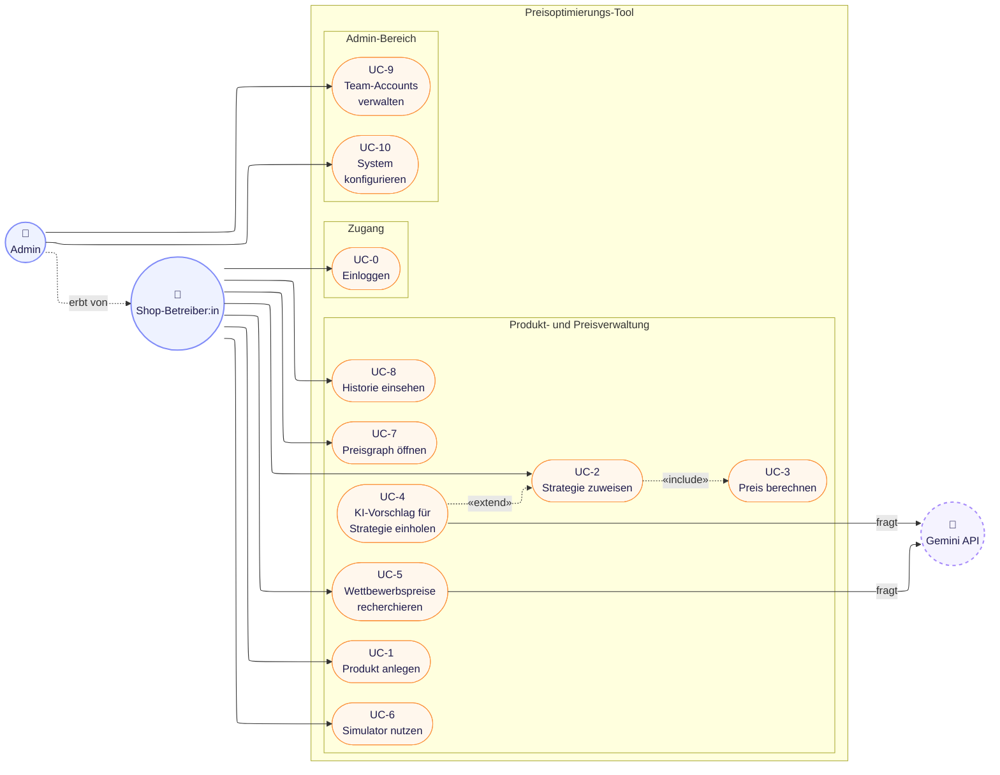

```mermaid
---
config:
  layout: elk
---
flowchart LR
 subgraph Auth["Zugang"]
        UC0(["UC-0<br>Einloggen"])
  end
 subgraph Kern["Produkt- und Preisverwaltung"]
        UC1(["UC-1<br>Produkt anlegen"])
        UC2(["UC-2<br>Strategie zuweisen"])
        UC3(["UC-3<br>Preis berechnen"])
        UC4(["UC-4<br>KI-Vorschlag für<br>Strategie einholen"])
        UC5(["UC-5<br>Wettbewerbspreise<br>recherchieren"])
        UC6(["UC-6<br>Simulator nutzen"])
        UC7(["UC-7<br>Preisgraph öffnen"])
        UC8(["UC-8<br>Historie einsehen"])
  end
 subgraph AdminArea["Admin-Bereich"]
        UC9(["UC-9<br>Team-Accounts<br>verwalten"])
        UC10(["UC-10<br>System<br>konfigurieren"])
  end
 subgraph System["Preisoptimierungs-Tool"]
    direction TB
        Auth
        Kern
        AdminArea
  end
    User(("👤<br>Shop-Betreiber:in")) --> UC0 & UC1 & UC2 & UC5 & UC6 & UC7 & UC8
    Admin(("👤<br>Admin")) -. erbt von .-> User
    Admin --> UC9 & UC10
    UC2 -. «include» .-> UC3
    UC4 -. «extend» .-> UC2
    UC4 -- fragt --> LLM(("🤖<br>Gemini API"))
    UC5 -- fragt --> LLM

     UC0:::usecase
     UC1:::usecase
     UC2:::usecase
     UC3:::usecase
     UC4:::usecase
     UC5:::usecase
     UC6:::usecase
     UC7:::usecase
     UC8:::usecase
     UC9:::usecase
     UC10:::usecase
     User:::actor
     Admin:::actor
     LLM:::external
    classDef actor fill:#eef2ff,stroke:#818cf8,stroke-width:2px,color:#1e1b4b
    classDef usecase fill:#fff7ed,stroke:#fb923c,stroke-width:1px,color:#1e1b4b
    classDef external fill:#f5f3ff,stroke:#a78bfa,stroke-width:2px,stroke-dasharray:5,5,color:#1e1b4b
    classDef subgraphStyle color:#1e1b4b

```
